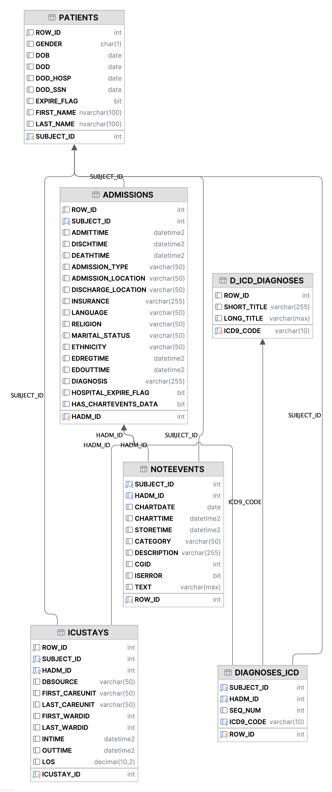

# Winter 2026 Project Phase 1

**Course:** SOEN 363: Data Systems for Software Engineers  
**Instructor:** Hamed Jafarpour  
**Date:** March 8, 2026  
**Contributors:**  
Fouad Elian (40273045)  
Junior Boni (40287501)  
Talar Mustafa (40284214)  
Karina Evangelista (40308529)  
Nicholas Martoccia (40303643)

---

# Task 1 — ER Diagram

## Entities
- Patients
- Admissions
- Hospitals
- Wards
- Physicians
- Clinical_Notes
- Procedures
- Diagnoses
- ICD_Dictionary
- ICU
- Units
- Employees
- Health_Care_Professionals


## Attributes

### Patients
- patient_id (PK)
- first_name
- last_name
- date_of_birth
- gender
- life_status

### Admissions
- admission_id (PK)
- admission_date
- discharge_date
- discharge_time
- demographic_status
- insurance_detail
- time_of_death

### Hospitals
- hospital_id (PK)
- name
- location

### Wards
- physical_location

### Physicians
- physician_id (PK)
- name

### Clinical_Notes
- note_id (PK)
- progress_notes
- radiology_reports
- discharge_summaries
- patient_id (FK)
- healthcareprofessional_id (FK)

### Procedures
- procedure_id (PK)
- description
- procedure_time

### Diagnoses
- diagnosis_id (PK)
- icd_code (FK)

### ICD_Dictionary
- icd_code (PK)

### ICU
- unit_type

### Units
- (no attributes)

### Employees
- (no attributes)

### Health_Care_Professionals
- (no attributes)


## Relationships
- Patients has Admissions
- Admissions has Clinical_Notes
- Admissions belongs to Hospitals
- Admissions assigned to Wards
- Patients receives Diagnoses
- Diagnoses occurs_during Admissions
- Procedures happens_during Admissions
- Diagnoses classified by ICD_Dictionary
- Physicians visits Admissions


## Primary Keys (PK)
- Patients: patient_id
- Admissions: admission_id
- Hospitals: hospital_id
- Physicians: physician_id
- Clinical_Notes: note_id
- Procedures: procedure_id
- Diagnoses: diagnosis_id
- ICD_Dictionary: icd_code


## Foreign Keys (FK)
- Clinical_Notes: patient_id
- Clinical_Notes: healthcareprofessional_id
- Diagnoses: icd_code


## Cardinality
- Patients → Admissions: 1-to-many
- Admissions → Clinical_Notes: 1-to-many
- Hospitals → Admissions: 1-to-many
- Wards → Admissions: 1-to-many
- Patients → Diagnoses: 1-to-many
- Admissions → Diagnoses: 1-to-many
- Admissions → Procedures: 1-to-many
- ICD_Dictionary → Diagnoses: 1-to-many
- Physicians ↔ Admissions: many-to-many

## ER Diagram


---

# Task 2 — Database Creation and Data Import

## Database Schema


---

# Task 3 — SQL Queries

## Query 1
List all patients who were admitted to the ICU and whose first care unit and last care unit were both “MICU”.
```sql
SELECT 
    P.FIRST_NAME, 
    P.LAST_NAME, 
    I.ICUSTAY_ID, 
    I.FIRST_CAREUNIT, 
    I.LAST_CAREUNIT
FROM PATIENTS P
JOIN dbo.ICUSTAYS I
    ON P.SUBJECT_ID = I.SUBJECT_ID
WHERE 
    I.FIRST_CAREUNIT = 'MICU' AND I.LAST_CAREUNIT = 'MICU';
```
### Comments
We have been asked to list all patients who were admitted to the ICU and for whom both the first and last care units were the MICU. To filter the correct patients, we first need to identify which patients were admitted to the ICU and then narrow it down to those admitted to the MICU. By joining the patient table with the ICU stays table, we can determine which patients were admitted to the ICU. The only thing left to do is filter by which patients had the MICU as their first and last care unit.
## Query 2
 Find all patients who had more than 3 hospital admissions in total.
```sql
SELECT 
    P.SUBJECT_ID, 
    P.FIRST_NAME, 
    P.LAST_NAME, 
    COUNT(*) AS admission_count
FROM PATIENTS P
INNER JOIN dbo.ADMISSIONS A ON P.SUBJECT_ID = A.SUBJECT_ID
GROUP BY P.SUBJECT_ID, P.FIRST_NAME, P.LAST_NAME
HAVING COUNT(*) > 3;
```
### Comments
First, we need to identify which patients have had more than three hospital admissions. First, we need to display the patients name and the number of admissions for each ID. Since the number of admissions isn't a column in any table, we need to compute it using the COUNT function. Finally, we need to group each admission by the patients first and last name, then narrow down the search by adding a HAVING clause that displays all patients with a count of four or more admissions.
## Query 3 
Retrieve the names and admission dates of patients who were discharged without any procedures.
```sql
SELECT
    p.FIRST_NAME, 
    p.LAST_NAME, 
    a.ADMISSION_TYPE, 
    a.ADMITTIME
FROM PATIENTS p INNER JOIN ADMISSIONS a
     ON p.SUBJECT_ID = a.SUBJECT_ID
WHERE EXISTS(
    SELECT 1
    FROM NOTEEVENTS ne_surg
    WHERE ne_surg.HADM_ID = a.HADM_ID
    AND ne_surg.TEXT NOT LIKE '%major surgical or invasive procedure%none%');
```
### Comments
First, we perform a select on the first and last names, admission type, and admission time of all patients from the patients and admissions tables, respectively. Then, we perform an inner join from the Patients table to the Admissions table on the Subject ID to isolate each patient to their admission. Next, we use a nested query to search the noteEvents table for instances where doctors noted that no major surgical or invasive procedures were performed. This retrieves the names and admission dates of patients discharged without undergoing any procedures.
## Query 4
List all patients who had both radiology exams and surgery during the same admission.
```sql
SELECT DISTINCT
    p.FIRST_NAME, p.LAST_NAME
FROM PATIENTS p INNER JOIN ADMISSIONS a
     ON p.SUBJECT_ID = a.SUBJECT_ID
WHERE
    EXISTS (
        SELECT 1
        FROM NOTEEVENTS ne_rad
        WHERE ne_rad.HADM_ID = a.HADM_ID
          AND ne_rad.CATEGORY = 'Radiology'
    )
  AND EXISTS (
    SELECT 1
    FROM NOTEEVENTS ne_surg
    WHERE ne_surg.HADM_ID = a.HADM_ID
      AND ne_surg.TEXT LIKE '%surgery%'
      AND ne_surg.TEXT NOT LIKE '%major surgical or invasive procedure%none%'
);
```
### Comments
To identify patients who underwent both radiology exams and surgery during the same admission, we must divide the query into two parts. First, we check for patients who received radiology exams. Then, we identify those patients who did undergo surgery during that admission. First, we join the patients with the admissions table on the subject ID. Next, to identify patients who have had radiology exams, we perform a nested query to select all notes where the category equals radiology. Finally, we perform a second nested query, using an "AND" operation to ensure that both conditions are met. This second query checks the notes events table to find where the doctor has listed no major surgical or invasive procedure. 
## Query 5
Find all ICU stays that lasted more than 7 days and the associated patient names.
```sql
SELECT
    P.FIRST_NAME, 
    P.LAST_NAME, 
    I.INTIME, 
    I.OUTTIME, 
    DATEDIFF(day, I.INTIME, I.OUTTIME) AS icu_stay_days
FROM dbo.PATIENTS P
JOIN dbo.ICUSTAYS I
    ON P.SUBJECT_ID = I.SUBJECT_ID
WHERE DATEDIFF(day, I.INTIME, I.OUTTIME) > 7;
```
### Comments
To get all ICU stays that lasted more than seven days and the associated patient names, we first need to select the patients' first and last names, as well as the number of days they stayed in the ICU, from the Patients and ICU tables, respectively. Then, we can perform a join from the Patients table to the ICU Stays table using the Subject ID to pair patients with their ICU stays. Finally, we need to count how long each patient stayed in the ICU (by subtracting the time they arrived from the time they left) and isolate those who stayed longer than seven days.
## Query 6
Count the number of admissions for each patient.
```sql
SELECT
    SUBJECT_ID,  
    COUNT(HADM_ID) AS admission_count
FROM dbo.ADMISSIONS
GROUP BY SUBJECT_ID;
```
### Comments
We are asked to get a count of all the times a patient was admitted. We first start by selecting the subject Id and a count of the HADM_ID. In order to get the count per person, we end the query with a group by subject ID. 
## Query 7
List all patients who were admitted via the emergency department and had at least one ICU stay.
```sql
SELECT DISTINCT
    P.FIRST_NAME, P.LAST_NAME
FROM dbo.PATIENTS P
JOIN dbo.ADMISSIONS A
    ON P.SUBJECT_ID = A.SUBJECT_ID
JOIN dbo.ICUSTAYS I
    ON A.HADM_ID = I.HADM_ID
WHERE A.ADMISSION_TYPE = 'EMERGENCY';
```
### Comments
We were asked to identify all patients who were admitted via the emergency department and had at least one ICU stay. To find these patients, we first need to join the admissions table to the patients table using the subject ID. Then, we need to join the admissions table to the ICU stays table to determine which patients were admitted to the ICU. Then, we narrow down the search to those whose admission type was emergency using a WHERE clause.
## Query 8
 Retrieve the most common diagnosis (ICD code) in ICU admissions.
```sql
SELECT TOP 1
    D.ICD9_CODE, 
    COUNT(*) AS diagnosis_count
FROM dbo.ICUSTAYS I
JOIN dbo.ADMISSIONS A
    ON I.HADM_ID = A.HADM_ID
JOIN dbo.DIAGNOSES_ICD D
    ON A.HADM_ID = D.HADM_ID
GROUP BY D.ICD9_CODE
ORDER BY diagnosis_count DESC;
```
### Comments
To find the most common diagnosis, we need to count the number of times a diagnosis code appears and select the code with the highest count. First, we need to find all the ICU admissions by joining the ICU stays table to the admissions table through the HADM ID. Then, we must join the Admissions table to the Diagnosis table to find the different diagnoses made during admissions, which is done by joining the two tables on the HADM ID again. Next, we need to group the different diagnoses together and order them from largest to smallest. This ensures that, when selecting the top one, we only get the diagnosis with the highest count.
## Query 9
Find the average length of stay in the ICU for each ICU type (e.g., MICU, SICU, CCU).
```sql
SELECT
    FIRST_CAREUNIT AS icu_type, 
    AVG(DATEDIFF(hour, INTIME, OUTTIME) / 24.0) AS avg_icu_stay_days
FROM dbo.ICUSTAYS
WHERE OUTTIME IS NOT NULL
GROUP BY FIRST_CAREUNIT;
```
### Comments
To find the average length of time a patient stayed in the ICU, we need to use the Average function. This function allows us to find the start time (INTIME), subtract it from the end time (OUTTIME), and then calculate the average length of stay. It's important that we add the necessary groupBy to separate the different averages by ICU type. 
## Query 10
List all patients who had surgery before being admitted to the ICU in the same admission.
```sql
SELECT DISTINCT
    p.FIRST_NAME, 
    p.LAST_NAME, 
    a.HADM_ID
FROM PATIENTS p
INNER JOIN ADMISSIONS a
    ON p.SUBJECT_ID = a.SUBJECT_ID
WHERE EXISTS (
    SELECT 1
    FROM NOTEEVENTS ne_surg
    WHERE ne_surg.HADM_ID = a.HADM_ID
      AND ne_surg.TEXT LIKE '%surgery%'
      AND ne_surg.TEXT NOT LIKE '%major surgical or invasive procedure%none%'
      AND EXISTS (
          SELECT 1
          FROM ICUSTAYS i
          WHERE i.HADM_ID = a.HADM_ID
            AND ne_surg.CHARTTIME < i.INTIME
      )
);
```
### Comments
We are looking for patients who underwent surgery prior to being admitted to the ICU during the same admission. First, we select the first and last names, as well as the hospital admissions, from the patients and admissions tables. Then, we can perform a join from the patients table to the admissions table using the subject ID. Next, we need to determine who had surgery and who had surgery before being admitted to the ICU. We can use a nested query that selects from the NOTEEVENT table to isolate the notes with the necessary keywords for determining who had surgery. Then, we can use another query to check if the chart time from the notes before the time listed in the ICU stays table for the same patient. 
## Query 11
 Retrieve the names of patients and the number of radiology exams they had during all admissions.
```sql
SELECT
    P.FIRST_NAME, 
    P.LAST_NAME, 
    COUNT(*) AS radiology_exam_count
FROM dbo.PATIENTS P
JOIN dbo.ADMISSIONS A
    ON P.SUBJECT_ID = A.SUBJECT_ID
JOIN dbo.NOTEEVENTS N
    ON A.HADM_ID = N.HADM_ID
WHERE N.CATEGORY = 'Radiology'
GROUP BY P.FIRST_NAME, P.LAST_NAME
ORDER BY radiology_exam_count DESC;
```
### Comments
First, we select the patients first and last name from the Patients table and a count, which we will label as Radiology Exam Count. To find which patients had radiology exams, we need to join the patients and admissions tables on the subject ID to match each patient with their admissions. Then, we join the Admissions table with the NOTEEVENTS table, which allows us to query results with the category "Radiology." Lastly, we simply group by the patient name to get a final result that counts how many times a patient has had a radiology exam.
## Query 12
Find patients who had discharge summaries containing the keyword “recovery”.
```sql
SELECT DISTINCT
    P.FIRST_NAME, 
    P.LAST_NAME
FROM dbo.PATIENTS P
JOIN dbo.ADMISSIONS A
    ON P.SUBJECT_ID = A.SUBJECT_ID
JOIN dbo.NOTEEVENTS N
    ON A.HADM_ID = N.HADM_ID
WHERE N.CATEGORY = 'Discharge summary'
  AND N.TEXT LIKE '%recovery%';
```
### Comments
First, we select distinct names from the Patients table. To find discharge summaries containing the word "recovery," we join Patients to Admissions by Subject ID, then Admissions to the NoteEvents table by HADM ID. Since we know which patients belong to which notes, we can narrow the search to discharge summaries containing "recovery."
## Query 13
List all admissions where the patient had no ICU/CCU stay but had radiology exams performed.
```sql
SELECT DISTINCT
    P.FIRST_NAME, 
    P.LAST_NAME, 
    A.HADM_ID
FROM dbo.ADMISSIONS A
JOIN dbo.PATIENTS P
    ON A.SUBJECT_ID = P.SUBJECT_ID
WHERE NOT EXISTS (
    SELECT 1
    FROM dbo.ICUSTAYS I
    WHERE I.HADM_ID = A.HADM_ID
)
AND EXISTS (
    SELECT 1
    FROM dbo.NOTEEVENTS N
    WHERE N.HADM_ID = A.HADM_ID
      AND N.CATEGORY = 'Radiology'
);
```
### Comments
The query can be broken into two parts: first, find the admissions of patients who haven't been admitted to the ICU or CCU, and second, find the admissions of those patients who have had a radiology exam. To find patients who haven't been admitted to the ICU or CCU, we can use a NOT EXISTS clause to pull all admissions that can't be found in the ICU stays table. Since the CCU is a type of ICU, this NOT EXISTS clause covers both types of admissions. Next, of the remaining admissions, we need to find those that have had a radiology exam. For this, we can use a simple EXISTS clause to find admissions with a radiology category.
## Query 14
Retrieve the patients with the longest hospital stay (admission to discharge).
```sql
SELECT TOP 10
    P.FIRST_NAME, 
    P.LAST_NAME, 
    A.ADMITTIME, 
    A.DISCHTIME, 
    DATEDIFF(day, A.ADMITTIME, A.DISCHTIME) AS days_at_the_hospital
FROM dbo.ADMISSIONS A
JOIN dbo.PATIENTS P
    ON A.SUBJECT_ID = P.SUBJECT_ID
WHERE A.DISCHTIME IS NOT NULL
ORDER BY days_at_the_hospital DESC;
```
### Comments
We can calculate how long a patient stays at the hospital using the following formula:
Discharge time (when they left) - Admission time (when they arrived).
To find the top patients, we need to order by this calculated time and display them in descending order. Selecting the top 10 gives us the 10 longest stays.
## Query 15
Count the total number of ICU transfers for each patient.
```sql
SELECT
    P.FIRST_NAME, 
    P.LAST_NAME, 
    I.SUBJECT_ID, 
    COUNT(I.ICUSTAY_ID) AS icu_count
FROM dbo.ICUSTAYS I
JOIN dbo.PATIENTS P
    ON I.SUBJECT_ID = P.SUBJECT_ID
GROUP BY
    P.FIRST_NAME, P.LAST_NAME, I.SUBJECT_ID
ORDER BY icu_count DESC;
```
### Comments
We can calculate the total number of ICU transfers for each patient by selecting the Subject ID and counting the number of transfers from the ICU stays table. To calculate the count, we must group each stay by subject ID. 
## Query 16
List patients who were admitted to multiple ICU types during the same admission.
```sql
SELECT
    P.FIRST_NAME, 
    P.LAST_NAME, 
    I.SUBJECT_ID, 
    I.HADM_ID, 
    COUNT(DISTINCT I.FIRST_CAREUNIT) AS icu_type_count
FROM dbo.ICUSTAYS I
JOIN dbo.PATIENTS P
    ON I.SUBJECT_ID = P.SUBJECT_ID
GROUP BY
    P.FIRST_NAME, P.LAST_NAME, I.SUBJECT_ID, I.HADM_ID
HAVING COUNT(DISTINCT I.FIRST_CAREUNIT) > 1;
```
### Comments
First, we need to select the subject ID, hospital admission ID, and the number of distinct first care units from the ICU stays table. To get a list of patients who were admitted to multiple ICU types, we need to group by subject and hospital admission ID, then filter to display only the counts of first care units greater than one.
## Query 17
Find all patients who had more than one diagnosis coded during a single admission.
```sql
SELECT
    P.FIRST_NAME, 
    P.LAST_NAME, 
    D.SUBJECT_ID, 
    D.HADM_ID, 
    COUNT(*) AS diagnosis_count
FROM dbo.DIAGNOSES_ICD D
JOIN dbo.PATIENTS P
    ON D.SUBJECT_ID = P.SUBJECT_ID
GROUP BY
    P.FIRST_NAME, P.LAST_NAME, D.SUBJECT_ID, D.HADM_ID
HAVING COUNT(*) > 1
ORDER BY diagnosis_count DESC;
```
### Comments
To find all patients with more than one coded diagnosis during a single admission, we need to select the Subject ID and Hospital Admission ID, then get a count of all diagnoses from the Diagnoses_ICD table. Next, we need to group by subject and admission ID, then filter the results to include only those with a count greater than one.
## Query 18
Retrieve the latest clinical note for each patient.
```sql
SELECT
    P.FIRST_NAME, 
    P.LAST_NAME, 
    N.SUBJECT_ID, 
    N.HADM_ID, 
    N.CHARTTIME, 
    N.CATEGORY, 
    N.TEXT
FROM dbo.NOTEEVENTS N
JOIN dbo.PATIENTS P
    ON N.SUBJECT_ID = P.SUBJECT_ID
WHERE N.CHARTTIME = (
    SELECT MAX(N2.CHARTTIME)
    FROM dbo.NOTEEVENTS N2
    WHERE N2.SUBJECT_ID = N.SUBJECT_ID
);
```
### Comments
We are asked to retrieve the most recent clinical note for each patient. First, we need to select the necessary information and join the note events table to the patient table. This will retrieve all notes associated with each patient. Using nested queries, we can select the maximum chart time, i.e., the latest chart time for each patient.
## Query 19
List all admissions where the patient died during the stay.
```sql
SELECT
    P.FIRST_NAME, 
    P.LAST_NAME, 
    A.HADM_ID, 
    A.SUBJECT_ID, 
    A.ADMITTIME, 
    A.DISCHTIME
FROM dbo.ADMISSIONS A
JOIN dbo.PATIENTS P
    ON A.SUBJECT_ID = P.SUBJECT_ID
WHERE A.HOSPITAL_EXPIRE_FLAG = 1;
```
### Comments
By filtering admissions with a hospital expire flag of 1, we can get the list all admissions where the patient died during the stay.
## Query 20
Find all patients who had surgery and radiology exams on the same day.
```sql
SELECT DISTINCT
    p.FIRST_NAME, 
    p.LAST_NAME, 
    a.HADM_ID
FROM PATIENTS p
INNER JOIN ADMISSIONS a
    ON p.SUBJECT_ID = a.SUBJECT_ID
WHERE EXISTS (
    SELECT 1
    FROM NOTEEVENTS ne_rad
    WHERE ne_rad.HADM_ID = a.HADM_ID
      AND ne_rad.CATEGORY = 'Radiology'
      AND EXISTS (
          SELECT 1
          FROM NOTEEVENTS ne_surg
          WHERE ne_surg.HADM_ID = a.HADM_ID
            AND ne_surg.TEXT LIKE '%surgery%'
            AND ne_surg.TEXT NOT LIKE '%major surgical or invasive procedure%none%'
            AND CAST(ne_rad.CHARTTIME AS date) = CAST(ne_surg.CHARTTIME AS date)
      )
);
```
### Comments
First, we need to join the Patients table to the Admissions table to match patients to their admissions. To find all patients who had surgery and radiology exams on the same day, we can perform a nested query. First, we should find all notes where the category is radiology. Then, using AND, we can find all instances where patients also had surgery. Finally, we must ensure that the chart time for the radiology date matches that of the surgery date.
